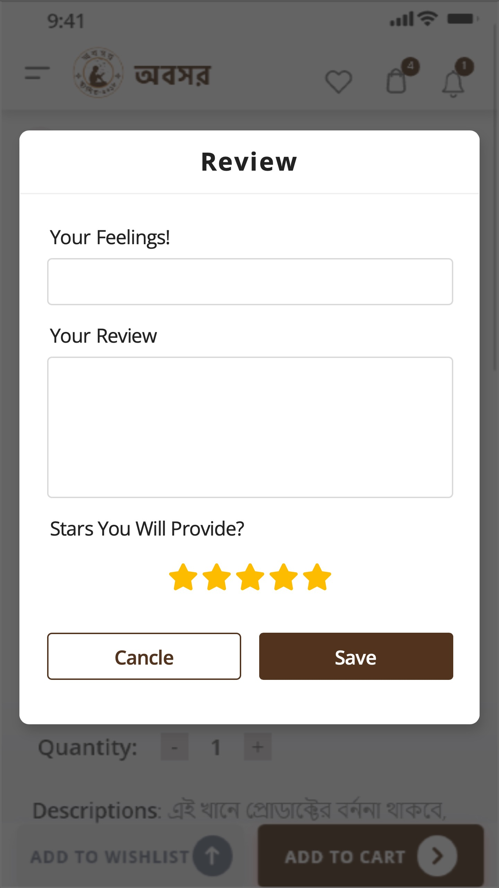

# ObosorApp
OBOSOR: Community &amp; Campus-based Online Book Shop


# ObosorApp

[![Contributors][contributors-shield]][contributors-url]
[![Forks][forks-shield]][forks-url]
[![Stargazers][stars-shield]][stars-url]
[![Issues][issues-shield]][issues-url]
[![MIT License][license-shield]][license-url]
[![LinkedIn][linkedin-shield]][linkedin-url]

<!-- PROJECT LOGO -->
<br />
<p align="center">
  <a href="https://github.com/khalid-syfullah/ObosorApp">
    
  </a>
 

  <h3 align="center">Obosor</h3>

  <p align="center">
    An Online E-Commerce BookShop Store app for Android.
  </p>
</p>

<!-- TABLE OF CONTENTS -->
<details open="open">
  <summary>Table of Contents</summary>
  <ol>
    <li>
      <a href="#about-the-project">About The Project</a>
      <ul>
        <li><a href="#built-with">Built With</a></li>
        <li><a href="#features">Features</a></li>
      </ul>
    </li>
    <li>
      <a href="#installation">Installation</a></li>
    </li>
    <li><a href="#usage">Usage</a></li>
    <li><a href="#roadmap">Roadmap</a></li>
    <li><a href="#contributing">Contributing</a></li>
    <li><a href="#license">License</a></li>
    <li><a href="#contact">Contact</a></li>
    <li><a href="#acknowledgements">Acknowledgements</a></li>
  </ol>
</details>

<!-- ABOUT THE PROJECT -->
## About The Project

Obosor is an Online E-Commerce BookShop Store Android app designed to provide users with an easy and convenient way to browse, search, and purchase books online. The app targets Bangladeshi users and offers a rich collection of books with a user-friendly interface to enhance the shopping experience.

<br />
<p align="center">

  
  
  
  <br><br>
  
  
  
  

  <br><br>
  
  
  
  
  <br><br>
  
  
  <br><br>
</p>

### Built With

* [Firebase](https://firebase.google.com)
* [Retrofit](https://square.github.io/retrofit/)
* [Picasso](https://square.github.io/picasso/)

### Features
- [x] User-friendly interface for browsing and purchasing books
- [x] Integrated product catalog with detailed book information
- [x] Secure user registration and login
- [x] Shopping cart and order management
- [x] Multiple payment options
- [x] Push notifications for offers and updates


### Installation

1. Clone the repo
   ```sh
   git clone https://github.com/khalid-syfullah/ObosorApp.git
   ```
2. Download & Install Gradle packages

4. Add dependencies in app `build.gradle` file
   ```Java
   dependencies {
    
    implementation 'com.google.firebase:firebase-analytics:17.2.2'
    implementation 'com.google.firebase:firebase-auth:19.3.2'
    implementation 'com.google.firebase:firebase-messaging:20.2.1'
    implementation 'com.squareup.retrofit2:retrofit:2.1.0'
    implementation 'com.squareup.retrofit2:converter-gson:2.1.0'
    implementation 'com.squareup.picasso:picasso:2.71828'
    implementation 'org.jsoup:jsoup:1.11.1'
    api 'com.theartofdev.edmodo:android-image-cropper:2.8.+'
    }

   ```


<!-- ROADMAP -->
## Roadmap

See the [open issues](https://github.com/khalid-syfullah/ObosorApp/issues) for a list of proposed features (and known issues).


<!-- CONTRIBUTING -->
## Contributing

1. Fork the Project
2. Create your Branch (`git checkout -b khalid-syfullah/ObosorApp`)
3. Commit your Changes (`git commit -m 'Add some Changes'`)
4. Push to the Branch (`git push origin khalid-syfullah/ObosorApp`)
5. Open a Pull Request


<!-- LICENSE -->
## License

Distributed under the MIT License. See `LICENSE` for more information.


<!-- CONTACT -->
## Contact

Your Name - [@khalid_syfullah](https://twitter.com/khalid_syfullah) - khalidsyfullah@gmail.com

Project Link: [https://github.com/khalid-syfullah/ObosorApp](https://github.com/khalid-syfullah/ObosorApp)


<!-- ACKNOWLEDGEMENTS -->
## Acknowledgements
* [Choose an Open Source License](https://choosealicense.com)
* [GitHub Pages](https://pages.github.com)

[contributors-shield]: https://img.shields.io/static/v1?label=Contributors&message=2&color=red
[contributors-url]: https://github.com/khalid-syfullah/ObosorApp/graphs/contributors
[forks-shield]: https://img.shields.io/static/v1?label=Forks&message=1&color=green
[forks-url]: https://github.com/khalid-syfullah/ObosorApp/network/members
[stars-shield]: https://img.shields.io/static/v1?label=Stars&message=1&color=blue
[stars-url]: https://github.com/khalid-syfullah/ObosorApp/stargazers
[issues-shield]: https://img.shields.io/static/v1?label=Issues&message=0&color=yellow
[issues-url]: https://github.com/khalid-syfullah/ObosorApp/issues
[license-shield]: https://img.shields.io/static/v1?label=Licenses&message=0&color=purple
[license-url]: https://github.com/khalid-syfullah/ObosorApp/blob/master/LICENSE.txt
[linkedin-shield]: https://img.shields.io/static/v1?label=LinkedIn&message=Khalid-Syfullah&logo=linkedin
[linkedin-url]: https://bd.linkedin.com/in/khalid-syfullah
[product-screenshot]: https://github.com/Khalid-Syfullah/ObosorApp/xd-exports/logo-image.png
